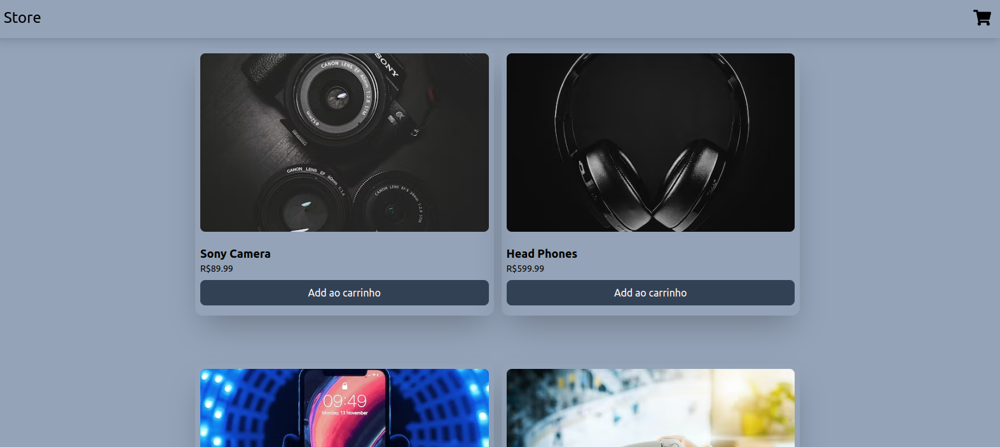
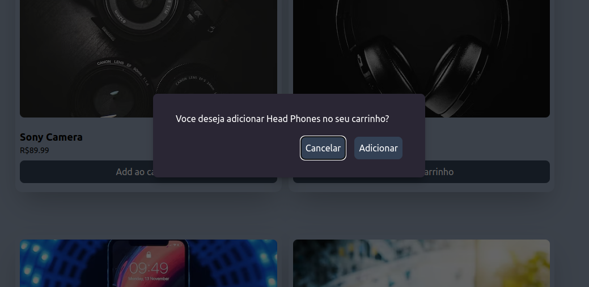
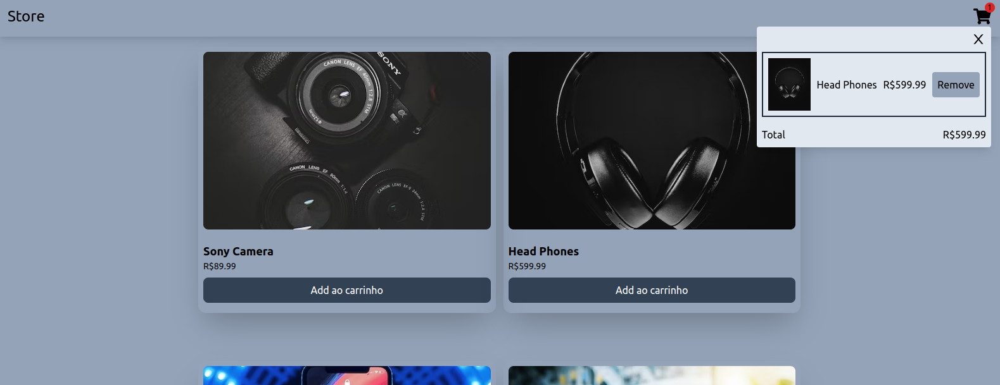

# Shopping Cart

Projeto desenvolvido para aprimorar meu conhecimento em ContextApi e Reducer

## Tecnologias utilizadas:

- React
- TailwindCSS
- Radix ui
- Vite
- React Icons

## Para visualizar o projeto funcionando, clique no link abaixo !

[https://shopping-cart-winkelstrotersergio.vercel.app/]

